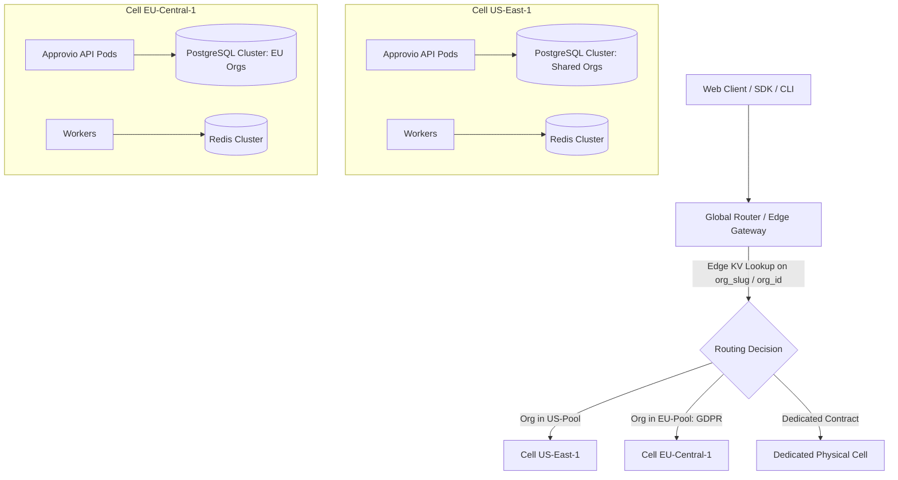
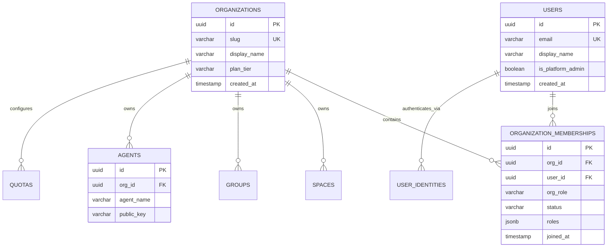
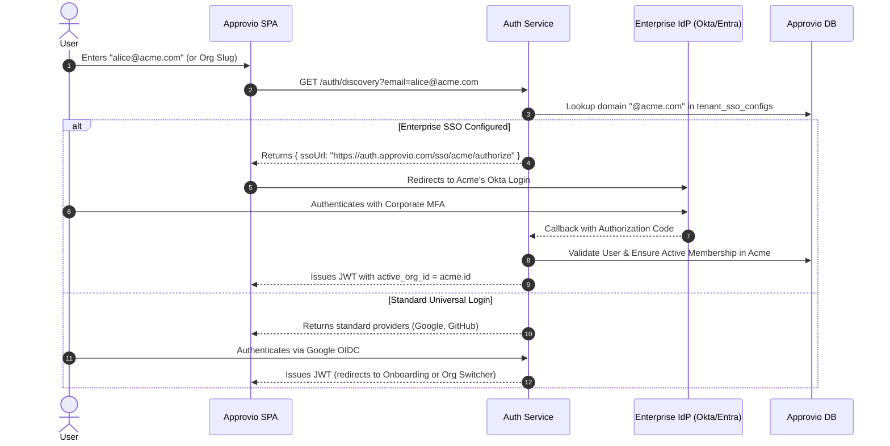
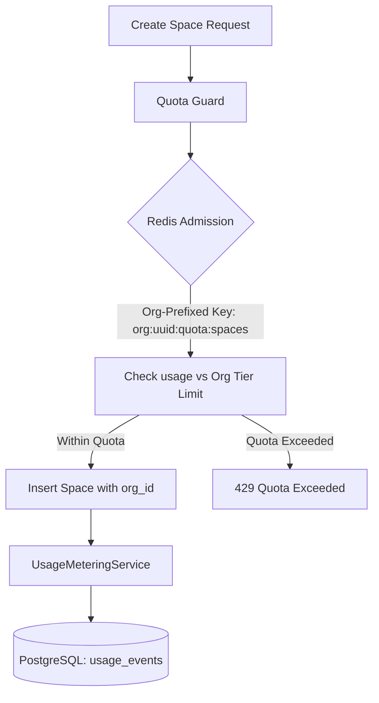
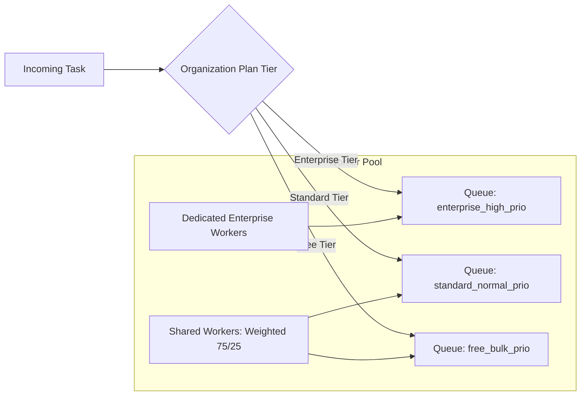

// TODO: As a general comment, this ADR is a bit too low level and implementation specific in certain aspect. This is a big ADR, so it should stay a bit high level (while being sure there is not echinical incompatibility with what we have) a maybe provide a bit insight when needed in an appednix. The rest is implementation detail that should not be here.

Also sometimes it is too vendor agnostic (Examples are fine but we can not tie and jump to conclusion). Also because Approvio not necessary meant to be deployed in Hyper Scaler, potentially it could be in smaller hosting providers.

# ADR 010: Multi-Organization Architecture and Tenancy Isolation

**Context / Scope:** Cross-System Architecture (`approvio`, `approvio-api`, `approvio-frontend`, `approvio-cli`, `approvio-ts-sdk`)

---

## 1. Context and Problem Statement

Currently, Approvio operates under an implicit single-tenant model. While domain services and API schemas pass an `orgId` parameter, this identifier is hardcoded across the entire backend to a singular constant:

```typescript
export const DEFAULT_ORG_ID = "00000000-0000-7000-8000-000000000000"
```

In the database, there is no `organizations` table. Core entities—including `spaces`, `groups`, `workflow_templates`, `agents`, `quotas`, and `audit_logs`—lack an `org_id` foreign key. Furthermore, uniqueness constraints on resource names (e.g., `spaces_name_unique`, `groups_name_unique`, `agents_agent_name_unique`) are enforced globally across the entire database instance. Users and system administrators are similarly scoped globally: a record in `organization_admins` grants administrative supremacy over every resource in the system.

As Approvio scales into a multi-tenant platform (ADR 009) and supports teams with multiple business units or workspaces, this single-organization design creates critical bottlenecks:

1. **Lack of Data Isolation:** Organizations cannot share an Approvio deployment with subsidiaries, external partners, or multiple clients without risking cross-tenant data exposure.
2. **Global Name Collisions:** Two distinct organizations cannot both create a space named `"Finance"` or a group named `"Approvers"`.
3. **Flat Entitlements & Metering:** Quotas, subscription tiers, and metered usage pools (ADR 009) cannot be partitioned or billed per organization.
4. **Rigid Identity Scoping:** A user cannot belong to multiple organizations (e.g., as a contractor or auditor) or switch contexts without managing separate credentials.
5. **Security & Compliance Risks:** Audit logs, cryptographic keys, and webhook tasks are co-mingled, violating SOC 2, HIPAA, and GDPR isolation standards.

### Greenfield Opportunity & Unified Multi-Org Model with Smart Masking

Because Approvio is currently pre-production with zero active production users, we have a **greenfield advantage**: we can execute clean, non-compromised breaking changes directly into database schemas, domain models, and API contracts without maintaining complex multi-release backward-compatibility shims.

Crucially, we do **not** want two divergent codebases or architectural modes ("single-org engine" vs. "multi-org engine"). Under the hood, Approvio is **always multi-org**:
- Every tenant-scoped entity strictly contains an `org_id` foreign key.
- All authorization checks and quotas evaluate with respect to an `org_id`.

For self-hosted installations and local developer setups, we **smartly mask** this multi-tenancy to provide a seamless single-workspace experience:
- **Zero-Friction Out-of-the-Box:** On initial launch, a default organization (`DEFAULT_ORG_ID`) is provisioned automatically.
// TODO: What would be required to have '(`/spaces` instead of `/o/default/spaces`)'. If this adds too much complexity, I believe just the UI portion is enough.
- **Smart UI Masking:** The web frontend and CLI inspect the user's memberships. If the user only has access to one organization, the UI completely hides multi-tenant scaffolding: no organization switcher dropdown is displayed in the navigation header, and routes resolve cleanly at the root (`/spaces` instead of `/o/default/spaces`).
- **Progressive Unmasking:** If a self-hosted administrator later decides to introduce multiple organizations (e.g., separate workspaces for Engineering, HR, Legal, or client subsidiaries), they simply invite members or create an organization. The multi-tenant capabilities unmask seamlessly with **zero schema migrations, zero code changes, and zero downtime**.

---

## 2. Tenancy Isolation Models (Exploration of Options)

The foundational architectural question is how tenant data is partitioned and isolated across the infrastructure and database tiers.


### Option 1: Dedicated Physical Database per Tenant (Future Enterprise Option)

Each organization is provisioned its own dedicated PostgreSQL database, Redis namespace, and application compute.

- **Realistic Framing:** Approvio is in its architectural inception. We are not an established managed service provider (MSP), and building an automated control plane to provision and orchestrate thousands of individual databases is premature over-engineering.
- **Strategic Value:** We retain Option 1 in our architectural toolkit as a specialized pattern for extreme enterprise requirements down the road (e.g., an enterprise customer demanding a physically isolated database in their own AWS account or an air-gapped on-premise installation).
- **Cons for Core Platform:**
  - Liquibase migrations must run sequentially across every customer database.
  - Baseline resource overhead eliminates freemium viability.
  - Connection pooling exhaustion with serverless or containerized backends.

### Option 2: Schema-per-Tenant (Logical Schema Isolation)

All organizations share a single PostgreSQL database instance, but each tenant has a dedicated PostgreSQL schema (e.g., `CREATE SCHEMA org_<uuid>`).

- **Pros:** Logical table separation without provisioning new databases.
- **Cons:**
  - **PostgreSQL Catalog Degradation:** PostgreSQL internal catalogs (`pg_class`, `pg_attribute`) degrade significantly past ~5,000 schemas due to lock contention.
  - **Migration Bottlenecks:** Liquibase must iterate over every schema on release.
  - **Prisma Friction:** Prisma lacks native support for dynamic schema switching over pooled connections without re-creating client instances or wrapping raw queries.

### Option 3: Shared Database, Row-Level Tenancy with Discriminator (`org_id`) (Recommended)

All organizations share common database tables. Every tenant-scoped table contains an indexed `org_id UUID NOT NULL REFERENCES organizations(id)` column. Data isolation is enforced through a multi-layered defense-in-depth model.


// TODO: I am not fully sold on the RLS approach. I mean it would be nice but I see potential issue around the SET LOCAL current org_if. What if we forget to unset or clean it. What does guarantee us to not mismanage it ?
#### How Isolation is Guaranteed Without Separate Databases:
1. **Application-Layer Type-Safe Scoping:** Repositories enforce `org_id` filtering on all operations. Prisma client extensions / middleware automatically inject `where: { orgId }` into queries, preventing developer oversight from querying across tenants.
2. **PostgreSQL Row-Level Security (RLS) as Defense-in-Depth:**
   - PostgreSQL RLS enforces row filtering directly at the database engine level.
   - When a transaction is checked out from the connection pool, the backend executes:
     ```sql
     SET LOCAL app.current_org_id = '<active-org-uuid>';
     ```
   - Each table has an RLS policy:
     ```sql
     CREATE POLICY tenant_isolation_policy ON spaces
     USING (org_id = current_setting('app.current_org_id')::uuid);
     ```
   - Even if raw SQL or an un-scoped query executes, PostgreSQL automatically restricts returned rows to the active organization.
3. **Cryptographic Tenant Isolation (Tenant DEKs):** Sensitive attributes (credentials, webhooks, private prompts) are encrypted with a unique Data Encryption Key (DEK) per tenant (ADR 006). A database dump leak cannot expose plaintext without the tenant's specific key.
4. **Referential Integrity:** Foreign keys tie all child records back to `organizations(id)` or their parent tenant-scoped resource.

---

### Horizontal Scalability & Cellular Architecture (The Multi-Cell SaaS Pattern)

To scale Option 3 globally without creating a monolithic database bottleneck, Approvio adopts a **Cellular SaaS Architecture**:



#### 1. What is a Cell?
A Cell is an independent, self-contained deployment unit consisting of:
- Approvio API service pods
- Asynchronous worker pods
- A shared PostgreSQL cluster (with PgBouncer)
- A Redis cluster

// TODO: Premature to provide numbers
Each cell typically hosts 2,000 to 10,000 organizations. If a cell fails or experiences a localized outage, other cells continue unaffected (isolated blast radius).

#### 2. Transparent Edge Routing: Edge KV vs. JWT Claims
A key design question is whether user JWTs should embed internal cluster hostnames (e.g. `cell_id: "cell-us-east-1.internal"`):
- **Why NOT raw infrastructure hostnames in JWTs:** Exposing internal cloud topology or VPC names in client-visible tokens leaks infrastructure layout to the browser.
- **Why NOT JWE (Encrypted Token Claims):** Encrypting claims via JWE introduces unnecessary asymmetric/symmetric cryptographic overhead on every single HTTP request at the edge.
- **The Recommended Solution (Edge KV Lookup or Opaque Tag):**
  - **Edge KV Directory (Primary):** Modern edge runtimes (Cloudflare Workers, Fastly Compute, Envoy with Redis) look up the tenant's cell destination in sub-millisecond time using the request's URL host or `org_slug` / `org_id`. The client token contains zero internal infrastructure metadata. When an organization moves between cells, updating a single key in the edge KV immediately redirects all traffic with **zero token re-issuance required**.
  - **Opaque Cell Tag (Alternative):** If edge lookups are undesirable, the JWT carries a short, non-descriptive tag (e.g., `cid: "c1"`). The edge gateway uses a static in-memory lookup table (`c1 -> internal cluster URL`), maintaining zero database lookups and zero information leakage.

#### 3. Regional Data Sovereignty (GDPR Compliance)
Organizations select their primary data region during onboarding. EU customers are allocated to `Cell-EU-Central-1`, guaranteeing that their approval workflows, audit logs, and encryption keys never leave European borders.

#### 4. Cell Rebalancing & Zero-Downtime Hot Migration Roadmap
A critical architectural test: *Does Option 3 allow on-the-fly (hot) rebalancing of organizations between cells without downtime?*

**Yes.** By choosing standard PostgreSQL with indexed `org_id` foreign keys, our technical choice preserves the roadmap capability for **zero-downtime hot rebalancing** via **PostgreSQL 15+ Row-Filtered Logical Replication**:

1. **Initial Baseline Sync:** A logical replication publication on the source cell streams data for only that tenant:
   ```sql
   CREATE PUBLICATION tenant_migration_pub FOR
     TABLE spaces WHERE (org_id = 'target-org-id'),
     TABLE groups WHERE (org_id = 'target-org-id'),
     TABLE workflow_templates WHERE (org_id = 'target-org-id'),
     TABLE workflows WHERE (org_id = 'target-org-id')...;
   ```
   The destination cell subscribes to this publication and copies historical rows in the background. The tenant remains 100% active and writable on the source cell.
2. **Streaming WAL Catch-Up:** Continuous logical replication catches up with active writes until replication lag drops below ~50ms.
3. **Micro-Pause Cutover (<50ms):**
   - The edge router temporarily pauses incoming HTTP writes for that specific `org_id` for 30–50ms.
   - The source cell flushes final pending WAL.
   - The edge KV directory updates: `org_id -> destination_cell`.
   - The edge router replays paused writes directly to the destination cell.
   - User-perceived impact: a momentary 50ms network blip with zero failed requests.
4. **Cleanup:** Source cell drops the publication and purges the migrated rows.

---

## 3. User Identity & Multi-Organization Membership Model

A critical architectural dimension is how human users and autonomous agents relate to organizations.



### Global User Identity + Organization Memberships

`User` represents a globally verified human principal identified by their unique email and linked OIDC identities (`UserIdentity`). Organizational relationships are governed by a separate `OrganizationMembership` entity.

- **`User`**: Global entity containing `id`, `email` (globally unique), `displayName`, `isPlatformAdmin`, and linked OIDC provider identities.
- **`Organization`**: The tenant container (`id`, `name`, `slug`, `tier`, `createdAt`).
- **`OrganizationMembership`**: Bridges `(org_id, user_id)`:
  - `org_role`: Foundational role within this specific organization (`"admin"` | `"member"`).
  - `status`: `"active"`, `"invited"`, `"suspended"`.
  - `roles`: Fine-grained RBAC roles (`BoundRole[]`) assigned within this specific organization.

### Autonomous Agents: Strictly Tenant-Scoped Principals

Unlike human users who may collaborate across organizations, autonomous **Agents** (software bots, CI/CD runners, AI evaluators) MUST be strictly tenant-scoped:
- `agents.org_id UUID NOT NULL REFERENCES organizations(id)`.
- Unique constraint: `@@unique([orgId, agentName])`.
- Cryptographic challenges and public key verifications are bound to the specific organization. An agent created in Org A can never vote, instantiate workflows, or read resources in Org B.

---

## 4. Authentication Architecture: Enterprise SSO & Universal Login

// TODO: or dedicated endpoints
Enterprise customers require dedicated Single Sign-On (SSO) with Okta, Microsoft Entra ID, or Google Workspace, while standard users use universal public social logins.



### Dual-Track Authentication Flow

1. **Track 1: Universal Social Login (Freemium / Standard Users)**
   - Login options: "Continue with Google" or "Continue with GitHub".
   - Authenticates against global OIDC providers configured in the platform.
   - Upon authentication, if the user belongs to multiple organizations, they choose their active organization or land on their default workspace.

2. **Track 2: Enterprise Dedicated SSO with Home Realm Discovery (HRD)**
   - **Step 1: Domain Discovery:** On the login screen, a single input field prompts: *"Enter your corporate email"*.
   - **Step 2: Lookup:** The frontend calls `GET /auth/discovery?email=alice@acme.com`.
   - **Step 3: IdP Redirection:** If `acme.com` has an enterprise SSO configuration, Approvio redirects Alice directly to Acme’s dedicated Okta/Entra instance with PKCE.
   - **Step 4: Just-In-Time (JIT) Provisioning:** Upon successful callback, if Alice is a new employee, Approvio automatically provisions her `User` record and assigns an active `OrganizationMembership` as `Member`.

### Enterprise SSO Enforcement
Enterprise organizations can toggle **"Enforce SSO"**:
- When enabled, any user with an `@acme.com` email address is strictly blocked from signing in with public Google/password credentials to access Acme Corp data.
- Even if Alice has a personal Approvio account via Google for side projects, accessing Acme Corp resources requires a session validated through Acme's corporate IdP.

---

## 5. Tenant Context Resolution & Request Routing

Every API request must unambiguously resolve its target organization.

### The Single Source of Truth: The JWT Access Token

To maximize performance and prevent authorization spoofing, **the JWT access token claim is the single source of truth**:
- The JWT includes:
  ```json
  {
    "sub": "user-uuid",
    "email": "alice@acme.com",
    "active_org_id": "org-uuid",
    "org_role": "admin"
  }
  ```
- The backend `JwtAuthGuard` extracts `active_org_id` directly from the token.
- **Stateless Authorization:** The backend does **not** need to query the database on every HTTP request to verify if the user belongs to the organization; the cryptographically signed token proves membership and active context.

### Role of Frontend URLs (`/o/:orgSlug/...`)
The frontend uses route namespacing (`https://app.approvio.com/o/acme/spaces`) for **browser navigation and deep linking**:
- Enables bookmarking and link sharing in Slack/email.
- When a user navigates to `/o/beta/...` while their current JWT is scoped to `acme`, the frontend detects the mismatch and automatically invokes:
  ```http
  POST /auth/token/switch-org
  Payload: { "targetOrgId": "beta-org-uuid" }
  ```
- The server validates membership in `beta`, issues a refreshed access token for `beta`, and the page loads seamlessly.

### Role of HTTP Header (`X-Organization-Id`)
The HTTP header `X-Organization-Id` is **optional** and primarily serves:
- **CLI & Service Accounts:** Automation scripts or API keys that have multi-org access pass the header to select context without exchanging tokens.
- If passed alongside a user JWT, the `JwtAuthGuard` validates:
  $$\text{Header}.\text{X-Organization-Id} == \text{Token}.\text{active\_org\_id}$$
  Rejecting with `403 Forbidden` on mismatch.

---

## 6. Subsystem Impact and Deep Architectural Considerations

---

### 6.1 Quota & Usage Metering System (ADR 009 Alignment)



#### 1. Dynamic Hierarchy Resolution
In `HierarchyService.getParents()`, root ancestors are resolved dynamically from the entity’s `org_id` instead of `DEFAULT_ORG_ID`:
```typescript
case "Group":
  return TE.right([{type: "Org", identifier: group.orgId}])
case "Space":
  return TE.right([{type: "Org", identifier: space.orgId}])
```
For `WorkflowTemplate` and `Workflow`, traversal resolves through:
$$\text{Workflow} \longrightarrow \text{WorkflowTemplate} \longrightarrow \text{Space} \longrightarrow \text{Org}(space.orgId)$$

#### 2. Cardinality Quotas (`MAX_SPACES`, `MAX_GROUPS`)
Pre-creation count checks are scoped by tenant:
```sql
SELECT COUNT(*) FROM spaces WHERE org_id = :orgId;
```

#### 3. Redis Fast Admission Namespacing
To avoid cross-tenant key pollution, all Redis keys are prefixed with `org_id`:
- Concurrency Semaphore: `org:{orgId}:quota:concurrent_workflows`
- Monthly Metered Token Reservations: `org:{orgId}:period:{billingPeriod}:tokens:reserved`
- Settled Usage Counters: `org:{orgId}:period:{billingPeriod}:tokens:settled`

#### 4. Durable Usage Ledger (`usage_events`)
The PostgreSQL `usage_events` table records metered operations. All usage rollups, monthly invoices, and tier overage calculations are strictly aggregated `WHERE entity_id = :orgId`.

---

### 6.2 RBAC, Permissions, and Organizational Roles

#### 1. Deprecation of Global `OrganizationAdmin`
The flat `organization_admins` table is removed. Administrative authority is granted via `OrganizationMembership.orgRole === OrgRole.ADMIN`. An Admin has full power **only within their organization**.

#### 2. Evolution of `OrgScope`
`OrgScope` in `app/domain/src/role.ts` evolves from `{ type: "org" }` to:
```typescript
export interface OrgScope {
  readonly type: "org"
  readonly orgId: string
}
```

#### 3. New User Onboarding & Standalone State
When a user registers for the first time via social login, they start in an **Unassigned State** (`memberships.length === 0`):
1. **Pending Invitations:** If an admin invited `alice@acme.com`, the UI prompts: *"You have been invited to Acme Corp. [Accept] / [Decline]"*.
2. **Domain Match:** If the domain matches an enterprise auto-join policy, she is automatically joined as a `Member`.
3. **New Organization Creation:** If uninvited, she is routed to the Onboarding wizard: *"Create your organization"*. Upon creation, she becomes `Admin` of the new organization.

#### 4. Platform Administration, Support Access & Direct DB Policies
A fundamental architectural concern is how platform operations and customer support are handled without creating an insecure "god mode":

- **Separation of Control Plane vs. Data Plane:**
  - **Control Plane (Metadata Only):** Platform operators manage subscription tiers, adjust quotas, inspect platform health, and trigger migrations via an isolated internal API (`/platform/...`). Operators can inspect tenant metadata but have **zero ambient access** to customer approval workflows or payloads.
- **Customer-Consented Support Impersonation ("Break-Glass Protocol"):**
  - Standard customer support cannot peek into private customer workflows.
  - When troubleshooting a stuck approval, support uses an **Opt-in Support Access** pattern:
    1. The customer Org Admin toggles *"Grant Approvio Support Access (24h)"* in Org Settings, OR an operator initiates a break-glass session tied to an audited Customer Ticket ID.
    // TODO: Make it longer (E.g 24-hours).
    2. An ephemeral, 1-hour session token is issued.
    // TODO: I don't think this is neede, also because will this appear to all users of org ? The one that escalated ? ...
    3. The UI renders a prominent warning banner: `⚠️ SUPPORT IMPERSONATION - TICKET #1234`.
    4. Every read and action is logged to an immutable security audit trail visible to the customer.
- **Direct Database Access:** Production database access is restricted strictly to database reliability engineers for emergency disaster recovery via audited bastions (Teleport / AWS SSM). Direct DB access is never used for daily customer support; furthermore, because sensitive fields are encrypted with tenant DEKs, raw SQL returns only ciphertext blobs.

---

### 6.3 Entity Uniqueness Constraints

Global uniqueness constraints are converted to composite tenant-scoped constraints:

| Entity | Old Constraint | Multi-Tenant Constraint | Rationale |
| :--- | :--- | :--- | :--- |
| **`spaces`** | `name UNIQUE` | `UNIQUE (org_id, name)` | Multiple orgs can have a `"Finance"` space. |
| **`groups`** | `name UNIQUE` | `UNIQUE (org_id, name)` | Multiple orgs can have an `"Approvers"` group. |
| **`agents`** | `agent_name UNIQUE` | `UNIQUE (org_id, agent_name)` | Multiple orgs can have an `"EvaluatorBot"`. |
| **`workflow_templates`** | `UNIQUE (name, version)` | `UNIQUE (space_id, name, version)` | Space-scoped template versioning. |
| **`users`** | `email UNIQUE` | `email UNIQUE` | Retained (Global human identity across orgs). |

---

### 6.4 Native Platform Integrations & Egress Network Security

// TODO: We don't integrate as of now. So I would say Approvio might want to integrate
Approvio integrates with external customer systems (Jira, Slack, GitHub, internal ERP/HRIS webhooks, customer external LLMs). In a shared multi-tenant SaaS, egress network security presents unique risks:


// TODO: Framing it as a trap is AI jargon
#### The Shared IP Allowlisting Trap (SSRF & Confused Deputy Vulnerability)
If multiple organizations share the same static NAT egress IP, an enterprise allowing that IP through their firewall cannot rely on the IP alone to prove the request came from their organization. A malicious tenant on Approvio could configure a webhook targeting Acme Corp's internal Jira, and Acme's firewall would allow the packet through because it originates from Approvio's shared NAT IP.

#### The 4-Layer Solution for Egress Security:
1. **Mandatory Application-Layer Authentication (HMAC Signatures & mTLS):**
   - Outbound webhooks are cryptographically signed with HMAC-SHA256 using a tenant-specific shared secret (`X-Approvio-Signature-256: sha256=...`).
   - The receiving system validates the signature. Even if an unauthorized tenant dispatches an HTTP call to Acme's endpoint, the signature verification fails.
2. **Strict Egress Proxy & SSRF Defense:**
   - Webhook workers route outbound requests through an egress proxy (e.g., Envoy / Smokescreen) that performs pre-flight DNS resolution.
   - Outbound requests targeting RFC 1918 private IP ranges (`10.0.0.0/8`, `172.16.0.0/12`, `192.168.0.0/16`), loopback (`127.0.0.1`), and cloud metadata services (`169.254.169.254`) are **strictly blocked**.
3. **The Outbound Tunnel Agent (The Enterprise Gold Standard):**
   - For enterprise customers that refuse to open inbound firewall ports or accept shared egress traffic, Approvio provides an **Approvio Tunnel Agent** (similar to Cloudflare Tunnel or GitHub Self-Hosted Runner).
   // TODO: How does this solve the security issue of a multi-tenant approvio cell ? (assuming we even want to assume solve this).
   - Deployed inside the customer's private network or VPC, the agent initiates an **outbound-only** secure WebSocket/mTLS connection to Approvio.
   - Approval webhook dispatches travel down this existing secure outbound tunnel to execute locally inside the customer network. The customer opens zero inbound firewall holes.
   // TODO: I believe we are hiding a lot of complexity. Also the same comment above applies here.
4. **Dedicated Egress IP Pools (Optional Enterprise Add-On):**
   - For enterprise customers whose systems strictly require IP allowlisting, outbound requests can be routed through an egress forward proxy with a static Elastic IP assigned exclusively to that tenant.

---

### 6.5 Comprehensive Encryption Architecture (In-Transit & At-Rest)

#### 1. Data in Transit
// TODO: Why mentioning Cloudlflare, keep vendor agnostic.
- **Public Ingress:** Mandatory TLS 1.3 (with TLS 1.2 fallback) terminated at the Cloudflare / WAF edge. HSTS enabled (`max-age=31536000; includeSubDomains; preload`).
// TODO: Who mentioned pods ?
- **Internal Microservices & Workers:** Mutual TLS (mTLS) between API pods, worker pods, Redis, and PostgreSQL.
- **Database Connections:** Enforced `sslmode=verify-full`.

#### 2. Data at Rest (Two-Tier Encryption)
// TODO: EBS ?
- **Infrastructure Tier:** Storage-level AES-256 encryption on all PostgreSQL disks, EBS volumes, and Redis snapshots.
- **Application Tier (Envelope Encryption with Tenant DEKs):**
  - Extending ADR 006, each organization has a unique 256-bit AES Data Encryption Key (DEK).
  - The DEK is encrypted using the platform KMS Master Key (or Enterprise BYOK KMS) and stored in `organizations.encrypted_dek`.
  - Sensitive columns (webhook credentials, integration secrets, private evaluator prompts) are encrypted with the organization's unique DEK before database writes.
  - Mathematical guarantee: Revoking an enterprise customer's BYOK key instantly renders all their stored secrets unreadable.

---

### 6.6 Asynchronous Tasks & Tiered Fair-Share Queues

Approvio executes background operations via worker queues (email notifications, Slack alerts, webhook dispatches, AI evaluations).



// TODO: Make it clear these are just examples of SLA

// TODO: Does the require requires different clusters and hence differnt clients in the Approvio backedn. Or the tiering is attached to the cell ?
#### Preventing Noisy Neighbors & Guaranteeing SLAs:
1. **Multi-Queue Tier Partitioning:**
   - `tasks:enterprise` (<500ms processing delay target)
   - `tasks:standard` (<5s processing delay target)
   - `tasks:free` (Best-effort background processing)
2. **Dedicated Worker Allocation:** Dedicated worker threads process the enterprise queue, preventing a sudden burst of 50,000 free-tier webhook calls from delaying critical enterprise approval notifications.
3. **Per-Tenant Token Bucket Rate Limiting:** Within each queue, jobs are rate-limited per `org_id` using Redis token buckets (e.g., Free tier: max 10 concurrent jobs; Enterprise tier: max 200 concurrent jobs).

---

### 6.7 Audit Logging & Data Compliance (ADR 004 Alignment)

- `audit_logs` table gains `org_id UUID NOT NULL`.
- **Partitioning:** Hash partitioning on `org_id` across 16 partitions, combined with BRIN indexing on `created_at` (ADR 004).
- **Enterprise Isolated Retention:** Enterprise tenants can configure custom retention windows (e.g. 7 years for financial compliance vs 90 days for standard).
- **GDPR Tenant Offboarding:** When an organization is deleted, its audit partitions and data can be purged reliably.

---

### 6.8 Frontend Architecture & User Experience

1. **Organization Switcher:** Dropdown in the top navigation showing all organizations the user belongs to, with active workspace indicators and a `"Create Organization"` action.
2. **URL Routing:** `/o/:orgSlug/spaces`, `/o/:orgSlug/settings/members`, `/o/:orgSlug/quotas`.
3. **Member Management & Invitations:**
   - Org Admins invite members via email with role selection (`Admin` vs `Member`).
   - Secure invitation tokens with expiry.
   - Recipient accepts invite to link their account to the organization.
4. **Smart Masking in Single-Org Environments:** When a user belongs to only one organization (such as standard self-hosted deployments), the organization dropdown and URL slug prefixes are automatically hidden, providing a clean, distraction-free single-workspace interface.

---

## 7. Migration Strategy & Greenfield Execution

Because Approvio has zero active production users, we can execute a **direct, clean schema transformation** without maintaining complex multi-release backward-compatibility bridges.

// TODO: Too low level and implementation plan details.
### Liquibase Migration Plan
1. **Create `organizations` and `organization_memberships` tables:**
   - Strongly typed foreign keys and unique constraints.
2. **Add `org_id UUID NOT NULL` directly to:**
   - `spaces`, `groups`, `agents`, `audit_logs`, `workflow_actions_*_tasks`.
3. **Update unique constraints to composite:**
   - `UNIQUE (org_id, name)` on spaces and groups.
   - `UNIQUE (org_id, agent_name)` on agents.
4. **Seed the default organization:**
   - Seed `DEFAULT_ORG_ID` (`00000000-0000-7000-8000-000000000000`) for development and integration test consistency.
5. **Drop `organization_admins` table:**
   - Migrate any test admin fixtures to `organization_memberships` with `org_role = 'admin'`.

---

## 8. Architectural Decisions Summary

| Dimension | Selected Approach | Key Rationale |
| :--- | :--- | :--- |
| **Data Storage Architecture** | **Shared Database + Row-Level `org_id` + RLS** | High density, linear cost, unified Liquibase migrations, defense-in-depth security. |
| **Macro Infrastructure** | **Cellular SaaS + Dedicated Pattern for Roadmap** | Scales horizontally via independent cells; standard PG logical replication keeps hot rebalancing viable. |
| **User Identity** | **Global Identity + Organization Membership** | Enables cross-org collaboration, unified OIDC login, and clean contractor/auditor access. |
| **Agent Identity** | **Strictly Tenant-Scoped (`agents.org_id`)** | Eliminates cross-tenant cryptographic ambiguity and prevents unauthorized autonomous actions. |
| **Context Resolution** | **Stateless JWT Claim (`active_org_id`)** | Zero database overhead on API requests; URL slugs used strictly for frontend deep-linking. |
| **Edge Routing** | **Sub-millisecond Edge KV Lookup** | Eliminates infra leaks in JWTs; avoids JWE encryption CPU overhead; enables instant routing updates. |
| **Enterprise Authentication** | **Home Realm Discovery (HRD) + Dedicated SSO** | Automatic routing to corporate Okta/Entra based on email domain; JIT user provisioning. |
| **Platform Administration** | **Control Plane vs. Data Plane + Consented Impersonation** | Operators have metadata-only access; customer support requires audited time-limited break-glass. |
| **Quota Enforcement** | **Org-namespaced Redis keys; dynamic `HierarchyService`** | Eliminates hardcoded `DEFAULT_ORG_ID`; enforces per-tenant limits and noisy-neighbor protection. |
| **Egress Security** | **HMAC Webhook Signatures + SSRF Proxy + Outbound Tunnel** | Solves the shared IP allowlisting vulnerability; eliminates inbound firewall openings for enterprises. |
| **Encryption Architecture** | **mTLS in transit + Tenant DEKs at rest** | Full encryption across internal services; mathematical data isolation per tenant with enterprise BYOK. |
| **Background Processing** | **Tier-Partitioned Multi-Queue with Fair Share** | Guarantees sub-second SLAs for enterprise tasks while preventing bulk free-tier starvation. |
| **Entity Constraints** | **Composite Unique `(org_id, name)`** | Prevents cross-tenant naming collisions on spaces, groups, and agents. |
| **Self-Hosted Delivery** | **Unified Multi-Org Engine with Smart UI Masking** | Single codebase; starts as a seamless single-workspace experience and expands frictionlessly. |
