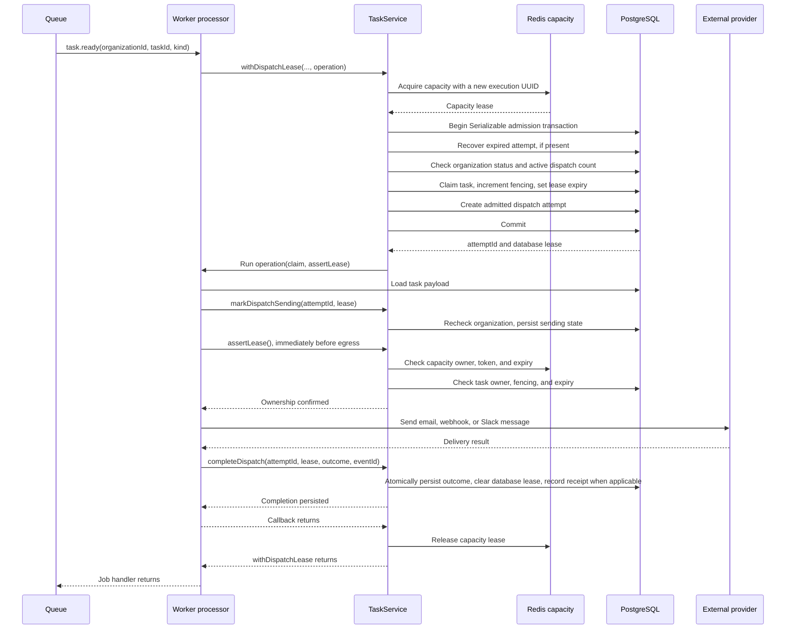
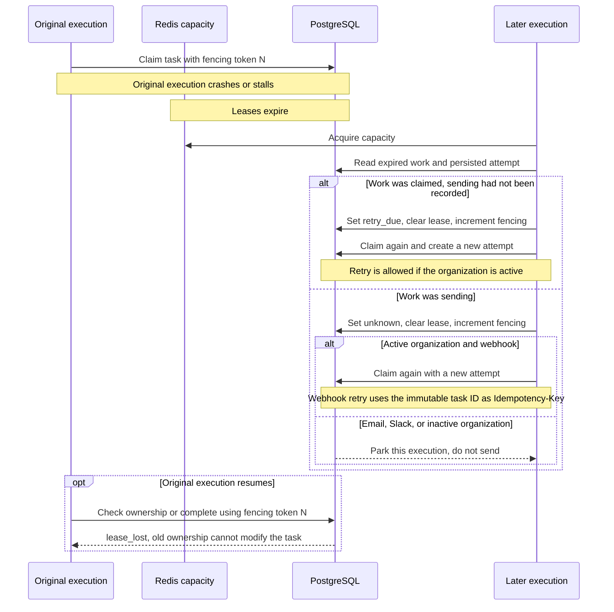

# Task dispatch: leases, delivery, and recovery

This describes the current implementation of `TaskService.withDispatchLease`. It starts when a worker receives a `task.ready` event; task generation and outbox publication happen earlier.

Two leases cover different resources:

| Lease                 | Purpose                                                       | Owner                           |
| --------------------- | ------------------------------------------------------------- | ------------------------------- |
| Redis capacity lease  | Limit simultaneous deliveries within an organization.         | A new UUID for each execution.  |
| PostgreSQL task lease | Authorize one execution to change this task's dispatch state. | Worker ID plus a fencing token. |

Their fencing tokens are independent. OCC tracks changes to a database row; the database fencing token identifies the current execution. Claiming or invalidating it increments fencing.

## Successful delivery

The database steps below go through `DispatchService` and `DispatchRepository`. Each transaction finishes before any external call starts.

Both leases have a fixed duration, defaulting to two minutes. Ownership checks do not extend expiry. There is no renewal timer. HTTP timeouts and retry limits should leave time for loading the task and persisting the outcome within that window. Webhooks have a 10-second timeout per request, and Slack a 5-second timeout. Email uses SMTP with explicit DNS, connection, greeting, and socket timeouts.

## Failure and crash recovery

On an ordinary callback failure, `TE.bracket` releases Redis capacity. It does **not** automatically clear the database lease: the processor must record an outcome, or a later execution recovers it after expiry. A process crash cannot run cleanup, so both leases expire naturally.

`sending` is recorded before the external call. A crash between that write and the call also produces `unknown`, even if nothing was sent. This is conservative: the database cannot prove whether the provider received the request.

If an ownership check fails, `assertLease()` rejects before egress. A call already in flight cannot be recalled by a lease check; fencing protects database writes, and downstream idempotency is still required to deduplicate external effects. A cleanup failure is logged and does not replace the delivery result. If processing exceeds the lease, completion is rejected and expired work must be recovered.

## Where the complexity comes from

| Requirement                                              | Mechanism used                                                         |
| -------------------------------------------------------- | ---------------------------------------------------------------------- |
| Organization isolation                                   | Explicit tenant context and PostgreSQL RLS.                            |
| Per-organization delivery concurrency                    | Redis capacity lease, plus a Serializable database count at admission. |
| Reject stale executions                                  | Database lease owner, expiry, fencing, and OCC predicates.             |
| Recover after crashes without blindly repeating delivery | Persisted admitted/sending attempts and unknown outcomes.              |

Tenant isolation alone does not require the two leases. Those come from concurrency limits, expiring ownership, and external-delivery recovery.

The heartbeat has been removed: a fixed two-minute lease trades longer crash recovery for a simpler execution path. Removing Redis capacity would require deciding whether the database admission count adequately covers the desired concurrency limit. Removing persisted attempts would lose the distinction between a crash before sending and an uncertain delivery. These remaining alternatives have not been implemented or validated.

## Code references

- [TaskService: capacity lifetime and processor API](../../app/services/src/task/task.service.ts)
- [DispatchService: admission, ownership checks, recovery, and completion](../../app/services/src/durable-work/dispatch.service.ts)
- [DispatchTransitionFactory: ownership checks and state transitions](../../app/services/src/durable-work/dispatch.models.ts)
- [Email processor: load, mark sending, assert lease, send, complete](../../app/worker/src/processor/workflow-action-email.processor.ts)
- [Lifecycle integration tests](../../app/services/test/durable-work/task-dispatch-lifecycle.integration.test.ts)
