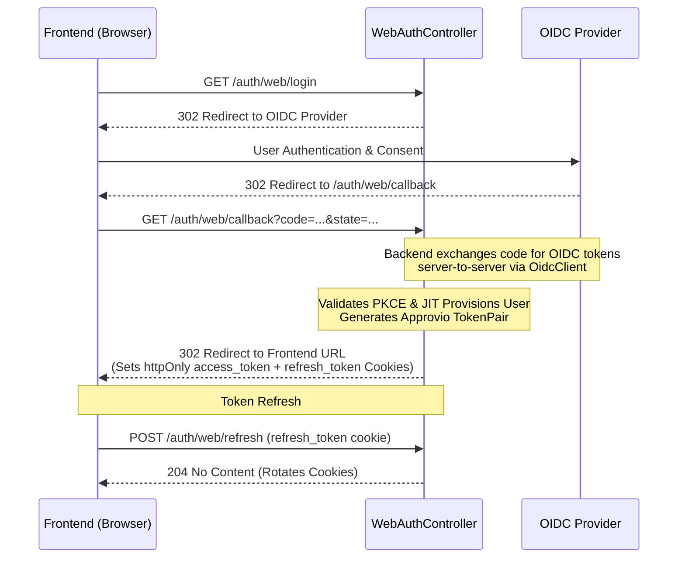
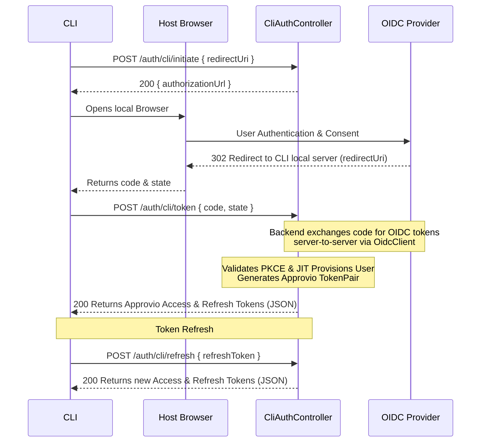
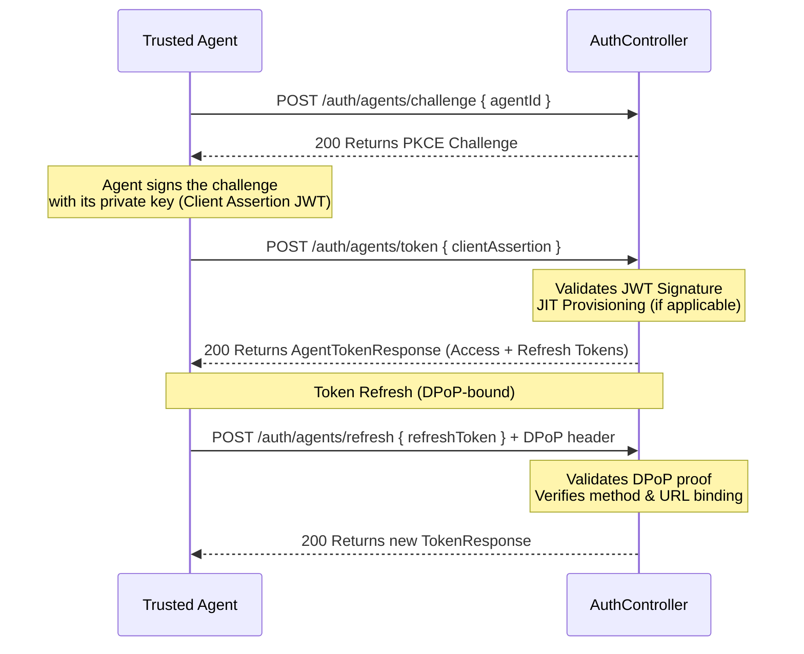

# Authentication Configuration

This document describes how to configure the authentication for the application. The application uses OpenID Connect (OIDC) for user authentication and supports various Identity Providers (IDPs) such as Google, Okta, and others.

## Configuration

Authentication is configured via environment variables.

### High Privilege Token Mode

The application supports a "step-up" authentication flow where users can exchange their standard session for a high privilege token by re-authenticating. This flow is used for sensitive operations.
This feature requires the IDP to support this kind of interaction, if using a custom provider, the mechanism will be disabled.

You can explicitly control this mode via a top-level environmental variable:

- `DISABLE_HIGH_PRIVILEGE_MODE`: (Optional) Boolean flag to globally disable the high privilege token mode. Defaults to `false`.

> [!IMPORTANT]
> The high privilege flow **does not support automatic registration**. Only pre-existing users can complete the step-up process. If an authenticated user from the IDP does not match an existing user in Approvio, the flow will fail.

> `DISABLE_HIGH_PRIVILEGE_MODE` will only disable the authentication flow. If the resources have been configured to require a high-privilege token, the application will still attempt to perform the high-privilege token flow, but it will fail fast.

## OIDC Provider Configuration

These variables are required for all providers:

- `OIDC_PROVIDER`: The type of OIDC provider being used. Acceptable values are `auth0`, `zitadel`, `keycloak`, or `custom`. Defaults to `custom`.
- `OIDC_ISSUER_URL`: The Issuer URL of the IDP (e.g., `https://accounts.google.com`).
- `OIDC_CLIENT_ID`: The Client ID obtained from the IDP.
- `OIDC_CLIENT_SECRET`: The Client Secret obtained from the IDP.
- `OIDC_REDIRECT_URI`: The callback URL where the IDP redirects after login (e.g., `http://localhost:3000/auth/web/callback`).
- `OIDC_SCOPES`: (Optional) Space-separated list of scopes to request. Defaults to `openid profile email`.

### Discovery (Recommended)

By default, the application uses OIDC Discovery (`.well-known/openid-configuration`) to automatically fetch the provider's configuration (authorization endpoint, token endpoint, etc.). This works out-of-the-box for most compliant providers like Google and Okta.

### Manual Configuration

If your provider does not support OIDC Discovery, you can manually configure the endpoints. To bypass the discovery process, you must set **ALL** of the following variables:

- `OIDC_AUTHORIZATION_ENDPOINT`: The authorization endpoint URL.
- `OIDC_TOKEN_ENDPOINT`: The token endpoint URL.
- `OIDC_USERINFO_ENDPOINT`: The userinfo endpoint URL.

**Note:** If you choose to configure manually, you must provide **all three** endpoints. If you provide some but not all, the application will throw an error at startup to prevent misconfiguration.

## Examples

### Google

1. Create a project in the [Google Cloud Console](https://console.cloud.google.com/).
2. Configure the OAuth consent screen.
3. Create OAuth 2.0 credentials (Client ID and Secret) for Web application type.
4. Set the authorized redirect URI to your application's callback URL.

```env
OIDC_ISSUER_URL=https://accounts.google.com
OIDC_CLIENT_ID=your-google-client-id
OIDC_CLIENT_SECRET=your-google-client-secret
OIDC_REDIRECT_URI=http://localhost:3000/auth/callback
OIDC_SCOPES=openid profile email
```

### Custom / Manual Configuration

For a provider that requires manual endpoint configuration:

```env
OIDC_ISSUER_URL=https://idp.example.com
OIDC_CLIENT_ID=your-client-id
OIDC_CLIENT_SECRET=your-client-secret
OIDC_REDIRECT_URI=http://localhost:3000/auth/callback

# Manual overrides
OIDC_AUTHORIZATION_ENDPOINT=https://idp.example.com/oauth2/authorize
OIDC_TOKEN_ENDPOINT=https://idp.example.com/oauth2/token
OIDC_USERINFO_ENDPOINT=https://idp.example.com/oauth2/userinfo
```

## Authentication Flows

Approvio utilizes a Token Mediated Backend architecture to authenticate requests. The authentication process is categorized into three primary flows: Web, CLI, and Agent (Machine-to-Machine).

### 1. Web Flow (Browser + Frontend)

The Web flow uses standard OIDC redirection and secures the session via `httpOnly` cookies.

**Endpoints:** `GET /auth/web/login`, `GET /auth/web/callback`, `POST /auth/web/refresh`, `POST /auth/web/initiatePrivilegedTokenExchange`, `POST /auth/web/exchangePrivilegedToken`



### 2. CLI Flow (Terminal + Browser)

The CLI flow involves initiating login via the CLI, performing authentication on the host browser, and finally exchanging the code for programmatic tokens on the CLI.

**Endpoints:** `POST /auth/cli/initiate`, `POST /auth/cli/token`, `POST /auth/cli/refresh`, `GET /auth/cli/initiatePrivilegedTokenExchange`, `POST /auth/cli/exchangePrivilegedToken`



### 3. Agent Flow (Machine-to-Machine)

Agents use an asymmetric key-pair (JWT Assertion) mechanism to securely authenticate without interactive logins.

**Endpoints:** `POST /auth/agents/challenge`, `POST /auth/agents/token`, `POST /auth/agents/refresh`



## Troubleshooting

- **Discovery Failed**: Ensure `OIDC_ISSUER_URL` is correct and accessible from the server. Check if `.well-known/openid-configuration` exists at that URL.
- **Redirect Mismatch**: Ensure `OIDC_REDIRECT_URI` exactly matches the one registered with your IDP.
- **Scopes**: Ensure the requested scopes are allowed for your client.
