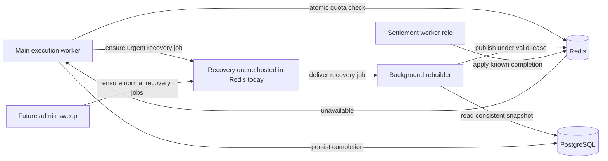
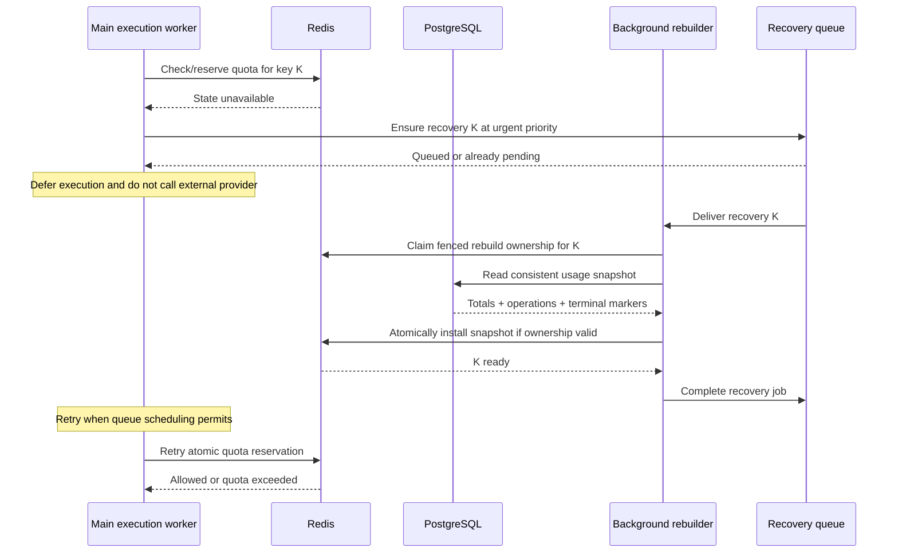
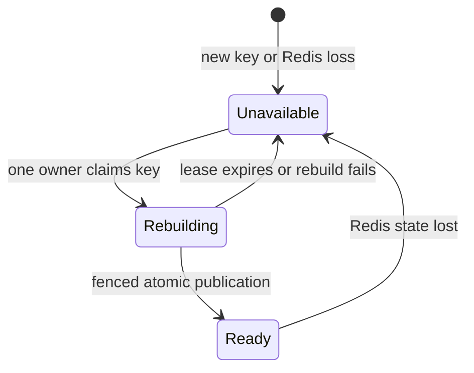
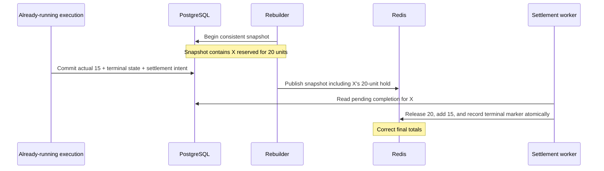

# Quota cache recovery

Status: accepted design. Implementation starts with on-demand queued recovery. Metered execution and bulk administrative recovery are future work.

## Assumptions and scope

Assume a Redis crash loses all Redis data across organizations. PostgreSQL retains usage operations, usage events, and settlement intents. Metered LLM execution is not implemented yet.

Accept Redis/queue downtime and loss of queued recovery requests. No PostgreSQL polling or PostgreSQL recovery scheduling is proposed. A future queue provider may change availability guarantees. Automated global loss detection and sweeping are deferred to future operational automation/admin APIs.

A quota key is organization + metric + billing period. Recovery reconstructs consumed units, outstanding reservations, and terminal operation markers. It does not rerun LLM work or calculate fresh usage from external providers.

## Who computes?

The background rebuilder computes snapshots. A main execution worker finding unavailable quota state enqueues an urgent recovery request and defers its execution job. A future admin-triggered sweep can enqueue normal-priority requests. Both feed the same rebuilder.

Two worker roles perform admission and recalculation. They can run in the same deployed worker service:

| Component | Responsibility |
| --- | --- |
| Main execution worker | Obtain quota admission before costly work; defer when state is unavailable; persist completion |
| Background rebuilder | Claim recovery work, read PostgreSQL, install a complete Redis snapshot |
| Redis | Atomic admission, operation markers, per-key readiness and fenced rebuild publication |
| PostgreSQL | Durable usage operations, events, and settlement facts |

Settlement delivery is an existing worker responsibility. It applies durable completion facts to Redis; it does not recalculate snapshots.

The future sweep schedules work and does not recalculate usage. The settlement role can also live in the existing worker service.

## Shared priority mechanism

Use one recovery job per quota key and two fixed priority classes, normal and urgent. There is no PostgreSQL scheduling table or polling loop.

- A main worker ensures that the recovery job exists at urgent priority.
- A future admin sweep ensures that it exists at normal priority and never demotes an urgent job.
- Promotion is a monotonic change from normal to urgent. Retrying the same task does not increase priority further. No per-task promotion history is needed.
- Duplicate enqueue/promotion must be atomic for a stable job identity derived from organization + metric + period. It must cover waiting, delayed, and active jobs.
- Active recovery is left running. Priority changes only affect queued work.
- Completed jobs must not suppress a later recovery of the same key. Remove/reset terminal scheduling state appropriately. If a late duplicate runs after the key is ready, it exits without rebuilding.
- Bounded rebuilder concurrency limits PostgreSQL load. Normal-priority fairness is relevant when the future sweep is added.

The installed Bull API supports stable job IDs and enqueue priority but has no public priority-change method. Initially, all on-demand recovery jobs use urgent priority. Normal-priority sweeping and promotion remain deferred with the admin sweep.

When Redis itself is down, neither admission nor enqueue is available. Workers defer with backoff. When it returns empty, a retried task submits recovery again. No guarantee is made that a queued execution task survives Redis loss: execution-job restoration/re-submission needs a separate operational policy.

Execution-job durability after Redis loss is a separate dependency: the existing worker/outbox design must recover jobs, not just quota counters. A quota recovery job does not itself recover a lost execution job. No new PostgreSQL polling is introduced to solve this.

## Requests already in flight

Yes: work admitted before the Redis crash can still be executing after the crash. Recovery must count its durable reservation. Blocking new admission does not require cancelling that work.

Use a per-key readiness gate. External execution does not hold the rebuild lease:

All Redis admission and settlement scripts check readiness atomically with their mutation. An earlier service-level check alone is insufficient: Redis can lose state between that check and reservation.

During rebuilding:

| Activity | Allowed? | Reason |
| --- | --- | --- |
| New costly execution without reservation | No | Counters are unavailable |
| Previously admitted external work continuing | Yes | Its durable hold is included in recovery |
| Committing actual usage to PostgreSQL | Yes | Durable facts remain authoritative |
| Applying a settlement to Redis | Defer | It must not mutate partially restored state |
| Publishing a snapshot | Rebuilder holding the valid per-key token and lease | An expired or replaced rebuilder cannot overwrite newer state |

Publication installs aggregates, operation markers, and readiness in one atomic Redis operation.

The owner is the rebuilder attempt holding a per-key random token with an expiry in Redis.

Example: rebuilder A claims K with token A. Its lease expires while it is reading PostgreSQL. Rebuilder B claims K with token B and restores it. When A eventually returns, Redis rejects its publication because token A is no longer valid. Otherwise A could overwrite B's newer state with an older snapshot.

The Redis publication checks the token, its expiry, and that the key is still rebuilding, atomically. Successful publication removes/inactivates rebuild ownership. Queue ownership alone cannot perform this check at the moment Redis is updated. If publication's reply is lost, a retry seeing a ready key exits rather than writing the old snapshot again.

## Completion during the snapshot read

Read usage operations and events in one consistent PostgreSQL snapshot. Completion commits the terminal operation, actual usage event, and settlement intent atomically.

A terminal marker is a Redis field identifying an operation that is already settled or cancelled, with its revision and actual units. It tells settlement delivery that this operation has already affected the totals.

Example with no other operations: X reserves 20 units and actually consumes 15.

| Timing | Snapshot installed in Redis | Later delivery of X's settlement |
| --- | --- | --- |
| X completes before the PostgreSQL snapshot boundary | consumed=15, reserved=0, marker X=settled/15 | Marker matches, so change no counters |
| X completes after that boundary | consumed=0, reserved=20, marker X=outstanding | Release 20, add 15, replace marker with settled/15 |

The snapshot boundary means the database view used for the complete read, not the time the rebuilder finishes reading. Atomic PostgreSQL completion prevents a snapshot from seeing a settled operation without its usage event.

A second replay case occurs without rebuilding:

1. Settlement worker updates Redis to consumed=15, reserved=0, X=settled/15.
2. It crashes before marking the PostgreSQL settlement intent delivered.
3. The same event is delivered again.
4. Redis sees the matching marker and returns success without adding another 15.
5. The worker can acknowledge delivery. A replay with conflicting actual units is an error.

This PostgreSQL acknowledgement belongs to the existing settlement design. It does not imply introducing a PostgreSQL polling scheduler. Delivery and restart recovery of unacknowledged events remain subject to the accepted queue limitations and future operational recovery policy.

A per-key readiness gate, consistent durable snapshot, atomic publication, and idempotent settlement let each quota key unblock independently.

## First use versus data loss

A missing Redis key cannot distinguish first use from lost state. The rebuilder reads PostgreSQL in either case: no durable facts means a zero snapshot; existing facts mean restoration. Explicit first-use initialization is an alternative, but requires durable evidence distinguishing a genuinely new key from a lost one.

## Admission and abandoned reservations

Current admission records a PostgreSQL reservation before reserving in Redis. A request can pass a readiness check, persist that record, then find Redis unavailable when it actually reserves.

Example: limit=100, consumed=70. Operation X writes a durable 40-unit reservation, but Redis disappears before admitting it. The rebuilt total becomes consumed=70, reserved=40. This does not prove that X was allowed to start.

Responsibilities:

| Situation | Responsible component | Action |
| --- | --- | --- |
| Recovered operation retries admission | Main execution worker through quota admission | Use the same operation ID and estimate, do not add a second hold, recheck admission against restored totals |
| Definitive quota rejection before execution | Main execution worker through quota service | Persist cancellation and enqueue its settlement so the recovered hold can be released |
| Recovery unavailable temporarily | Main execution worker | Defer rather than cancel an operation that may still retry |
| Already-running operation completes | Its execution worker | Persist actual usage and enqueue settlement |
| Job abandoned, worker lost, or queue lost | Future task-lifecycle/admin recovery | Determine whether work started or completed before cancelling its durable hold |

The rebuilder reconstructs facts. It must not infer that an old reservation is abandoned merely because it is old: external work may still be running or its outcome may be unknown.

For X above, the current recovered admission logic rejects because 70+40 exceeds 100. The main worker would then cancel X. That orchestration is proposed and not yet wired into metered execution.

An already-admitted operation whose Redis record was lost is also recovered as a hold. A new admission check must not cause an external call to be repeated. The metered execution lifecycle must persist admission/start state before calling an external provider and define an idempotency policy for unknown outcomes. Current quota operation status alone does not provide that distinction.

Automatic abandoned-hold cleanup is deferred. An explicit operational/admin repair is needed if a hold has no surviving execution job. Retaining such holds is conservative and can block capacity until repaired. The task lifecycle and unknown external outcome policy must be designed before automating cancellation.

## Billing-period boundary

Freeze the billing period when the metered operation is first durably reserved. Retries and settlement keep that period; the operation does not migrate at midnight or month end.

Example: X reserves in June and completes in July. Its actual usage is charged to June, and July starts with separate quota state. Rebuilder reads X under June. A new operation first reserved in July uses July.

The period remains attached to the operation throughout retries and settlement. A job merely queued in June but first reserved in July would use July under this policy.

Historical completed periods need no Redis state for reports: PostgreSQL serves those. An old period with outstanding work or an undelivered settlement may still need its Redis key under the current settlement contract. Restore only that specific old key when necessary. No sweep of all historical periods is proposed.

## Execution retry policy

Recovery deferrals use backoff and do not consume ordinary execution-failure attempts. Repeated requests leave the recovery job at urgent priority. No per-task priority history is needed.

Redis loss can remove execution and recovery jobs. Accept queue downtime and lost scheduling state. After Redis returns, surviving or resubmitted execution jobs request recovery again. Operational recovery must restore jobs with no surviving delivery.

## Implementation boundaries

The initial implementation queues recovery on demand and returns a distinct retryable quota-cache-unavailable error. Only the recovery handler restores Redis from the durable snapshot. Historical reports read PostgreSQL directly. Preserve the existing atomic Redis admission, settlement, and fenced restoration operations.

Use a dedicated recovery queue so urgent recovery cannot be starved by settlement jobs waiting for the same cache. Completed and failed recovery jobs must not permanently suppress a new request for the same key.

Do not add a PostgreSQL polling scheduler, autonomous global-outage detector, bulk sweep, or automatic orphan cleanup. The existing periodic usage-settlement scan is removed. Administrative recovery APIs and a future queue provider can extend the process later.

Before wiring LLM execution, persist admission/start state, keep the original period and operation ID across retries, distinguish recovery deferrals from execution failures, and define external-call idempotency. Current quota status alone cannot prove whether execution started.
