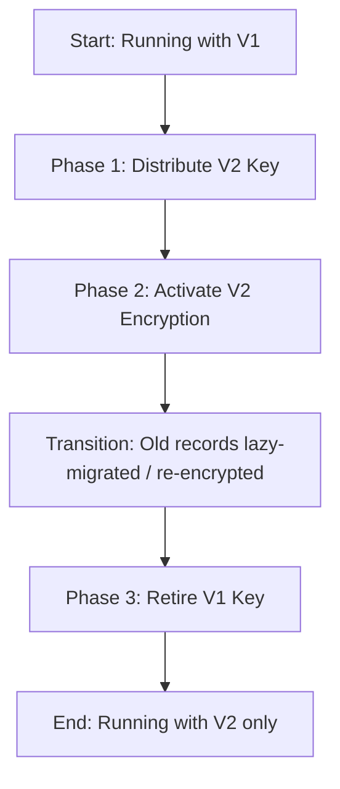

# KMS Key Rotation Guide

This document describes the 3-phase process for rotating the KMS master keys in the Approvio backend platform safely without causing decryption failures or database corruption.

Since we use application-level encryption for sensitive fields, database records are encrypted with unique Data Encryption Keys (DEKs) wrapped by versioned KMS Master Keys. Decrypting old records requires keeping old Master Keys available in the environment until all records have been migrated.

---

## The 3-Phase Rotation Process

Rotating from `V1` to `V2` must be executed as follows:

### Phase 1: Distribute

Add the new key material to the environment of all backend Node.js and worker instances.

- **Action**: Add the new key `KMS_MASTER_KEY_V2` to the environment variables alongside the existing `KMS_MASTER_KEY_V1`. Keep `KMS_MASTER_KEY_ACTIVE_VERSION` set to `v1`.
- **Result**: All running instances are configured to load both keyrings. Nodes can decrypt records encrypted with either `V1` or `V2`, but all new writes are still encrypted using `V1`.
- **Precaution**: Make sure this change is deployed to 100% of instances in the cluster. During rolling deployments, older instances running on the old config won't have `V2` loaded yet, which is safe since no data is being encrypted with `V2` yet.

### Phase 2: Activate

Switch the active encryption version to the new key.

- **Action**: Change the environment variable `KMS_MASTER_KEY_ACTIVE_VERSION` from `v1` to `v2`.
- **Result**: New data writes (such as newly created webhook tasks or workflow actions) will now be encrypted using the `V2` master key. Existing records can still be successfully decrypted using the `V1` key which remains in the keys map.
- **Precaution**: This phase must only be executed **after** Phase 1 is completely deployed to all nodes in the cluster.

### Phase 3: Retire (Cleanup)

Remove the old key material from the environment after all data has been re-encrypted.

- **Action**: Remove the environment variable `KMS_MASTER_KEY_V1`.
- **Result**: Only the `V2` key remains in the environment.
- **Precaution**: **CRITICAL:** Only perform this step when you are 100% certain that **no database records are still encrypted using V1**. If any records remain encrypted with `V1` after you remove the key, they will become **permanently unreadable/corrupted**.
  - Payloads are lazy-migrated (decrypted with old keys and re-encrypted with the active key) on read/write.
  - Before retiring `V1`, run a batch re-encryption script or check database records to verify all records have transitioned to `v2`.
