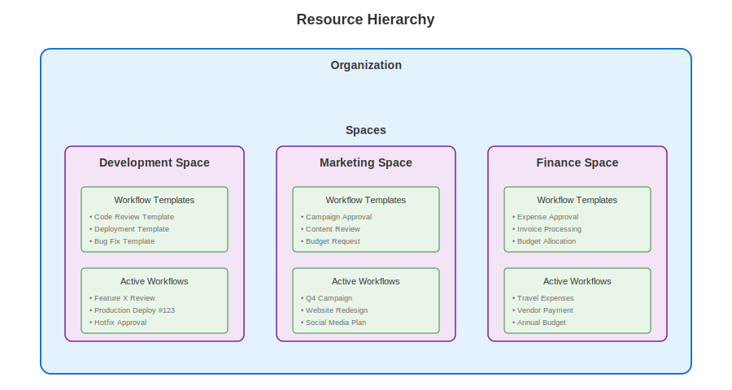
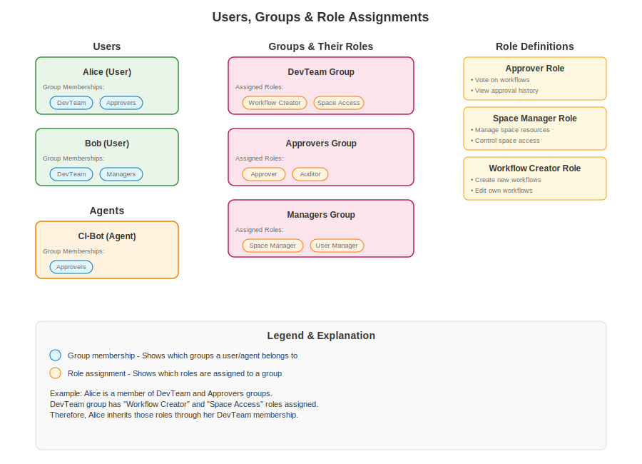

# Permissions System

The permissions system controls access to resources and operations through a hierarchical structure of organizations, spaces, groups, and roles. This document describes the complete authentication and permissions model.

## Architecture Overview

The system follows a resource hierarchy and permission assignment model:

- **Organization** → **Spaces** → **Resources** (workflows, templates, etc.)
- **Users/Agents** ↔ **Groups** (many-to-many relationships with identity labels)
- **Roles** can be assigned to **Users**, **Agents**, or **Groups** to grant permissions
  
  

## Core Entities

### Organization

Organizations serve as the top-level container for all resources:

- **Org Admin Management**: Organization administrators manage user imports and organizational settings
- **Resource Container**: Contains all spaces, groups, and users within the deployment

### Spaces

Spaces are organizational containers similar to projects or folders:

- **User-Created**: Each user can create their own spaces
- **Resource Container**: Contains workflow templates, templates, and other resources
- **Scoped Permissions**: Permissions can be granted at the space level

### Users vs Agents

The system distinguishes between two types of entities:

#### Users

- **Workflow Template Creation**: ✅ Can create workflow templates
- **Workflow Creation**: ✅ Can create workflows
- **Voting**: ✅ Can vote on workflows
- **Group Creation**: ✅ Can create groups
- **Space Creation**: ✅ Can create spaces

#### Agents

- **Workflow Template Creation**: ❌ Cannot create workflow templates
- **Workflow Creation**: ✅ Can create workflows
- **Voting**: ✅ Can vote on workflows
- **Group Creation**: ❌ Cannot create groups
- **Space Creation**: ❌ Cannot create spaces

### Groups (Identity Labels)

Groups serve as identity labels and collections of users and agents:

- **Organization Level**: Defined at the organization level
- **Many-to-Many Relationships**: Users and agents can belong to multiple groups, and groups can contain multiple users and agents
- **Mixed Membership**: Can contain both users and agents
- **Identity Function**: Act as labels/identities rather than permission containers
- **No Direct Actions**: Groups themselves don't grant additional permissions
- **Role Assignment Target**: Roles can be assigned to groups, granting permissions to all members

### Roles (Permission Grants)

Roles provide the actual permission system:

- **Permission Grants**: Give permissions on resources (global or specific)
- **Assignment Targets**: Can be assigned to individual users, agents, or entire groups
- **Token-Embedded**: Included in authentication tokens for efficient validation
- **API Validation**: API server validates token authenticity and assumes embedded permissions are valid if the token in valid
- **Resource Scoped**: Can be global or specific to particular resources
- **Examples**: vote_on_workflows, create_workflow_templates, manage_space_X

## Organizational Roles

Users have organizational-level roles that provide system-wide permissions:

- **Admin**: Full system access, can manage all groups, users, and spaces
- **Member**: Standard user with limited permissions, can create own spaces and groups.

## Group Membership Roles

Within groups, users can have administrative roles:

- **ADMIN**: Group administration, can manage memberships and settings (Users only)

## Permission Model Details

### Workflow Permissions

#### Voting Rights

Users and agents can vote on workflows if they meet all conditions:

- **Group Membership**: Must belong to a group referenced in the workflow's approval rules
- **Role Requirement**: Must have appropriate voting role assigned (directly or through group membership)

#### Template Creation

- **Users Only**: Only users can create workflow templates
- **Space Scoped**: Templates are created within specific spaces
- **Permission Required**: User must have template creation permissions in the target space

#### Workflow Creation

- **Users and Agents**: Both entity types can create workflows
- **Space Access**: Must have access to the space containing the template

### Space Permissions

#### Creation Rights

- **User Privilege**: Only users can create spaces
- **Personal Spaces**: Each user can create their own spaces

### Group Management

#### Creation and Administration

- **User Privilege**: Only users can create groups
- **Organization Level**: Groups are defined at the organization level
- **Mixed Membership**: Groups can contain both users and agents

## Token-Based Authorization

### Token Structure

The authentication system embeds permissions directly in tokens:

- **Role Information**: Tokens contain user/agent roles and permissions
- **Space Access**: Space-specific permissions included
- **Group Memberships**: Group roles embedded for efficient lookup
- **Validation**: API server validates token signature and trusts embedded permissions

### Permission Validation

- **Server Trust**: API server assumes token permissions are valid after signature verification
- **No Database Lookup**: Permissions checked without real-time database queries for performance
- **Token Refresh**: Tokens refreshed periodically to reflect permission changes

## Security Considerations

### Vote Integrity

- Vote permissions are validated at vote time, not workflow creation time
- Template changes don't affect existing workflow voting permissions
- Agent voting capabilities equal to users within approved groups

### Permission Changes

- Permission changes require token refresh to take effect
- Group membership changes reflected in new tokens
