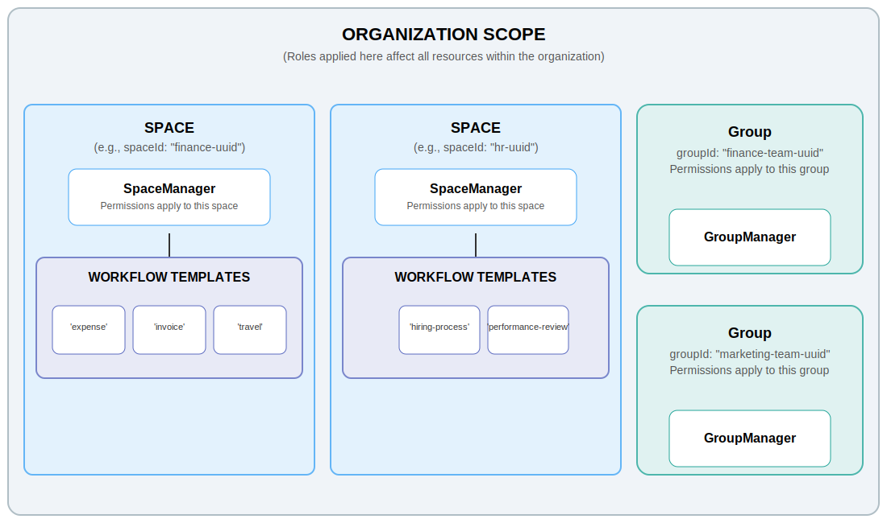

# Roles

The role system provides fine-grained access control through a comprehensive Role-Based Access Control (RBAC) model. Roles define what operations users and agents can perform on different resources, with permissions scoped at various organizational levels.

## Core Concepts

### What Are Roles?

Roles are named sets of permissions that grant specific capabilities on resources. Each role:

- Has a **name** that describes its purpose (e.g., "SpaceManager", "WorkflowTemplateVoter")
- Contains a set of **permissions** (e.g., read, write, manage)
- Applies to a **resource type** (e.g., spaces, workflow templates, workflows)
- Operates within a **scope** (e.g., organization-wide, specific space, specific template)

### Role Scopes

Roles can be scoped at different levels of the organizational hierarchy:

### Scope Types

1. **Organization (`org`)**: Applies to all resources of a type across the organization
2. **Space (`space`)**: Applies to a specific space and templates within it
3. **Group (`group`)**: Applies to a specific group
4. **Workflow Template (`workflow_template`)**: Applies to a specific workflow template

## Role Types

The system provides predefined roles for each resource type:

### Group Roles

Control access to groups and their memberships:

| Role              | Permissions         | Description                    |
| ----------------- | ------------------- | ------------------------------ |
| **GroupReadOnly** | read                | View group information         |
| **GroupWrite**    | read, write         | View and modify group settings |
| **GroupManager**  | read, write, manage | Full control over group        |

**Scope:** Group-specific only (no org-wide group roles)

### Space Roles

Control access to spaces and their organization:

| Role              | Permissions  | Description                                |
| ----------------- | ------------ | ------------------------------------------ |
| **SpaceReadOnly** | read         | View space information                     |
| **SpaceManager**  | read, manage | View and manage space (including deletion) |

**Scopes Available:**

- Space-specific: Applies to one space
- Organization-wide: Applies to all spaces

### Workflow Template Roles

Control who can create, modify, and use workflow templates:

| Role                             | Permissions              | Description                          |
| -------------------------------- | ------------------------ | ------------------------------------ |
| **WorkflowTemplateReadOnly**     | read                     | View template details                |
| **WorkflowTemplateWrite**        | read, write              | View and modify templates            |
| **WorkflowTemplateInstantiator** | instantiate              | Create workflow instances            |
| **WorkflowTemplateVoter**        | vote                     | Vote on workflows from this template |
| **WorkflowTemplateFullAccess**   | All template permissions | Complete template control            |

**Scopes Available:**

- Workflow Template-specific: Applies to one template
- Space-level: Applies to all templates in a space
- Organization-wide: Applies to all templates

### Workflow Roles

Control who can view, cancel, and manage workflow instances:

| Role                   | Permissions                                   | Description                      |
| ---------------------- | --------------------------------------------- | -------------------------------- |
| **WorkflowReadOnly**   | workflow_read                                 | View workflow details            |
| **WorkflowList**       | workflow_read, workflow_list                  | List and view workflows          |
| **WorkflowCancel**     | workflow_read, workflow_list, workflow_cancel | List, view, and cancel workflows |
| **WorkflowFullAccess** | All workflow permissions                      | Complete workflow control        |

**Scopes Available:**

- Workflow Template-specific: Applies to workflows from one template
- Space-level: Applies to workflows from all templates in a space
- Organization-wide: Applies to all workflows

## Role Limits

- Maximum **128 roles** per user or agent
- Duplicate roles (same name + scope) are automatically deduplicated
- Role assignments are additive - assigning new roles keeps existing roles

## Authorization Rules

### Who Can Assign Roles?

Role assignment is governed by strict authorization rules:

**Organization Admins:**

- Can assign any role at any scope
- Can assign org-wide roles
- Can override all permission boundaries

**Space Managers:**

- Can assign space-scoped roles for their spaces
- Can assign template-scoped roles for templates in their spaces
- Cannot assign org-wide roles

**Group Managers:**

- Can assign group-scoped roles for their groups
- Cannot assign space or template roles

## Integration with Other Features

### Spaces

When a user creates a space, they automatically receive:

- **SpaceManager** role for that space
- Both read and manage permissions

### Groups

Group membership is separate from roles:

- Group membership determines voting eligibility
- Group roles control group management
- Both are needed: membership + voter role to vote

### Voting

To vote on a workflow, an entity (user or agent) needs:

1. **Voter role** for the workflow template (at any scope)
2. **Group membership** in the required approval group
3. Workflow must be in **EVALUATION_IN_PROGRESS** state

### Workflow Templates

Template permissions control:

- Who can modify template definitions (write permission)
- Who can create workflows from templates (instantiate permission)
- Who can vote on workflows from templates (vote permission)

See [Workflow Templates](./workflow-templates.md) for more details.
