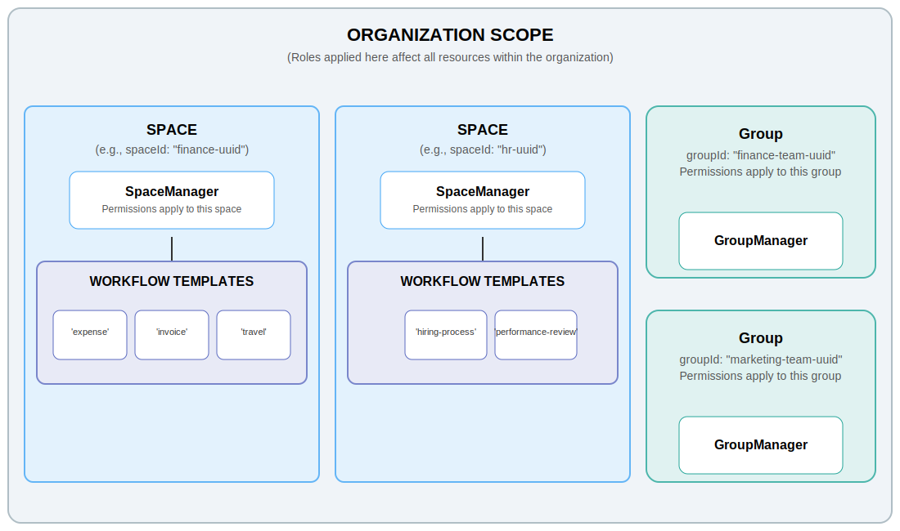

# Roles

The role system provides fine-grained access control through a comprehensive Role-Based Access Control (RBAC) model. Roles define what operations users and agents can perform on different resources, with permissions scoped at various organizational levels.

## Core Concepts

### What Are Roles?

Roles are named sets of permissions that grant specific capabilities on resources. A role is defined by several key attributes. First, it has a distinct name that describes its purpose, such as "SpaceManager" or "WorkflowTemplateVoter". Second, it contains a specific set of permissions like read, write, or manage. Third, a role applies to a specific resource type, which could be spaces, workflow templates, or workflows. Finally, each role operates within a defined scope, ranging from an organization-wide impact to being restricted to a specific space or template.

### Role Scopes

Roles can be scoped at different levels of the organizational hierarchy:

### Scope Types

| Scope                                       | Description                                                |
| :------------------------------------------ | :--------------------------------------------------------- |
| **Organization (`org`)**                    | Applies to all resources of a type across the organization |
| **Space (`space`)**                         | Applies to a specific space and templates within it        |
| **Group (`group`)**                         | Applies to a specific group                                |
| **Workflow Template (`workflow_template`)** | Applies to a specific workflow template                    |

## Role Types

The system provides predefined roles for each resource type:

### Group Roles

Control access to groups and their memberships:

| Role              | Permissions         | Description                    |
| ----------------- | ------------------- | ------------------------------ |
| **GroupReadOnly** | read                | View group information         |
| **GroupWrite**    | read, write         | View and modify group settings |
| **GroupManager**  | read, write, manage | Full control over group        |

**Scope:** Group-specific only (no org-wide group roles)

### Space Roles

Control access to spaces and their organization:

| Role              | Permissions  | Description                                |
| ----------------- | ------------ | ------------------------------------------ |
| **SpaceReadOnly** | read         | View space information                     |
| **SpaceManager**  | read, manage | View and manage space (including deletion) |

**Scopes Available:**

- Space-specific: Applies to one space
- Organization-wide: Applies to all spaces

### Workflow Template Roles

Control who can create, modify, and use workflow templates:

| Role                             | Permissions              | Description                          |
| -------------------------------- | ------------------------ | ------------------------------------ |
| **WorkflowTemplateReadOnly**     | read                     | View template details                |
| **WorkflowTemplateWrite**        | read, write              | View and modify templates            |
| **WorkflowTemplateInstantiator** | instantiate              | Create workflow instances            |
| **WorkflowTemplateVoter**        | vote                     | Vote on workflows from this template |
| **WorkflowTemplateFullAccess**   | All template permissions | Complete template control            |

**Scopes Available:**

- Workflow Template-specific: Applies to one template
- Space-level: Applies to all templates in a space
- Organization-wide: Applies to all templates

### Workflow Roles

Control who can view, cancel, and manage workflow instances:

| Role                   | Permissions                                   | Description                      |
| ---------------------- | --------------------------------------------- | -------------------------------- |
| **WorkflowReadOnly**   | workflow_read                                 | View workflow details            |
| **WorkflowList**       | workflow_read, workflow_list                  | List and view workflows          |
| **WorkflowCancel**     | workflow_read, workflow_list, workflow_cancel | List, view, and cancel workflows |
| **WorkflowFullAccess** | All workflow permissions                      | Complete workflow control        |

**Scopes Available:**

- Workflow Template-specific: Applies to workflows from one template
- Space-level: Applies to workflows from all templates in a space
- Organization-wide: Applies to all workflows

### Audit Roles

Control access to view system-wide audit logs:

| Role              | Permissions | Description                                         |
| ----------------- | ----------- | --------------------------------------------------- |
| **AuditorViewer** | read        | View all system audit logs across the organization. |

**Scopes Available:**

- Organization-wide: Applies to all audit logs in the system

## Role Limits

The system enforces specific limits and behaviors regarding roles to maintain efficiency and clarity. A user or agent can have a maximum of 128 roles assigned to them. If duplicate roles—meaning roles with the exact same name and scope—are assigned, the system automatically deduplicates them.

## Authorization Rules

### Assignment Capabilities

Role assignment is governed by strict authorization rules based on the user's current role:

| Role                    | Capabilities                                                                                                        | Restrictions                           |
| :---------------------- | :------------------------------------------------------------------------------------------------------------------ | :------------------------------------- |
| **Organization Admins** | Can assign any role at any scope, can assign org-wide roles, and can override all permission boundaries.            | None                                   |
| **Space Managers**      | Can assign space-scoped roles for their spaces, and can assign template-scoped roles for templates in their spaces. | Cannot assign org-wide roles.          |
| **Group Managers**      | Can assign group-scoped roles for their groups.                                                                     | Cannot assign space or template roles. |

## Integration with Other Features

### Spaces

When a user creates a space, they are automatically granted the **SpaceManager** role for that specific space. This built-in assignment ensures the creator immediately has both read and manage permissions, allowing them to fully administer their new space.

### Groups

It is essential to understand that group membership is separate from roles. While group roles are responsible for controlling the management of the group itself, it is the group membership that ultimately determines an entity's voting eligibility in workflows. To successfully cast a vote, an entity must possess both the appropriate membership in the required group and the corresponding voter role.

### Voting

Voting on a workflow is a multi-conditional action. For an entity (whether a user or an agent) to cast a vote, they must hold the **Voter role** for the workflow template at an applicable scope. They must also hold membership in the required approval group. Finally, the workflow itself must currently be in the **EVALUATION_IN_PROGRESS** state.

### Workflow Templates

Permissions at the template level act as the primary control mechanism for the lifecycle of workflows. They dictate who is authorized to modify the template definitions via the write permission, who is allowed to create new workflow instances via the instantiate permission, and who is permitted to participate by voting on those workflows via the vote permission.

See [Workflow Templates](./workflow-templates.md) for more details.
