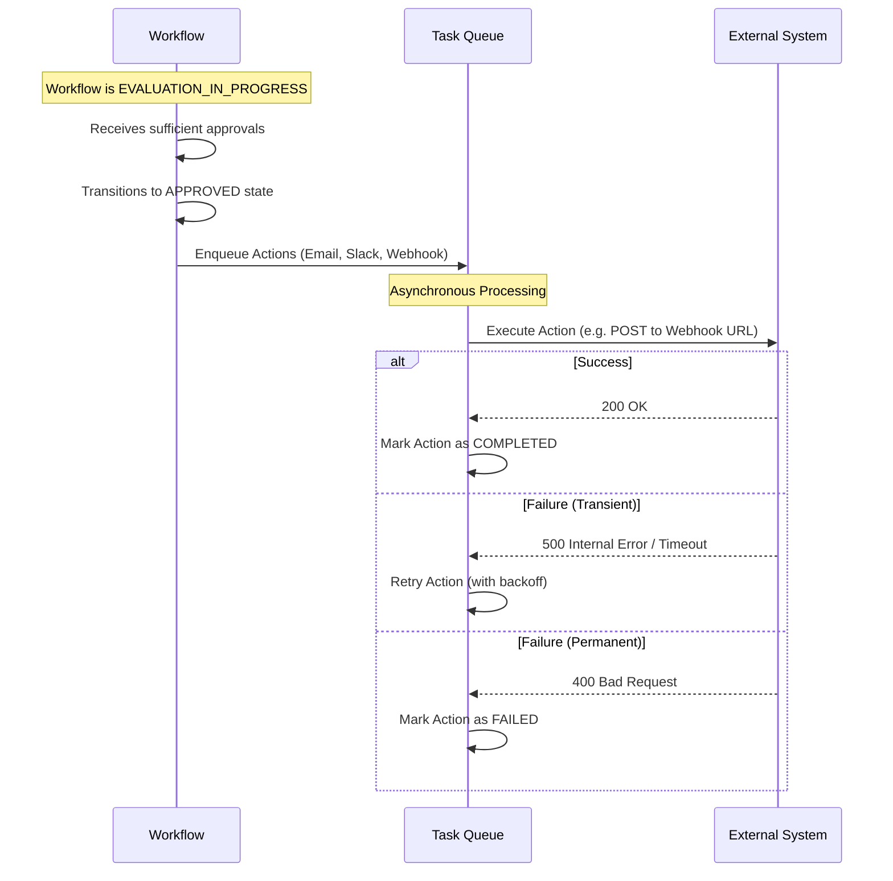

# Workflow Actions

Workflow Actions are automated tasks that the system executes when a workflow reaches a specific state, typically when it is formally approved. These actions enable Approvio to seamlessly integrate with external systems and automate post-approval processes.

## Action Types

Approvio supports three main types of workflow actions:

| Action Type | Description                                                          | Common Use Cases                                                                                        |
| :---------- | :------------------------------------------------------------------- | :------------------------------------------------------------------------------------------------------ |
| **EMAIL**   | Sends an email notification to a list of recipients.                 | Notifying stakeholders of an approved request, sending an audit summary.                                |
| **SLACK**   | Sends a message to a Slack channel via an Incoming Webhook.          | Alerting a team channel about a deployment approval, notifying managers of a budget request.            |
| **WEBHOOK** | Sends an HTTP POST request to an external URL with workflow details. | Triggering a CI/CD pipeline deployment, updating an external ticketing system, syncing data with a CRM. |

## Lifecycle and Execution

Actions are defined within a Workflow Template. When a workflow instantiated from that template reaches the required state (e.g., `APPROVED`), the system asynchronously schedules and executes the defined actions.

## Retry Mechanism

To ensure reliability, the action execution system includes a robust retry mechanism for transient failures.

- **Webhooks:** The system will retry webhook deliveries if the external server responds with a transient error (like a 5xx status code) or times out. To ensure exactly-once semantics during retries, Approvio injects an `Idempotency-Key` header into the webhook payload. External systems should use this key to prevent processing the same action multiple times.
- **Emails:** The email provider treats SMTP 4xx codes as transient failures suitable for retries, while SMTP 5xx codes are considered permanent failures and will not be retried.

Permanent failures (like invalid configurations or 4xx HTTP responses) will cause the action to be marked as `FAILED` without further retries.
