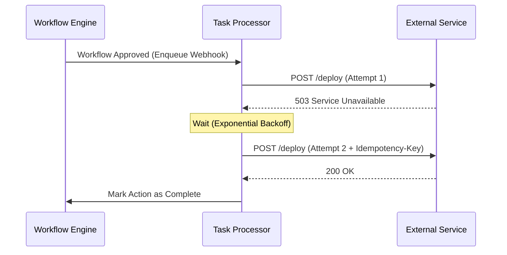

# Workflow Actions

Workflow Actions define the automated steps that occur once a workflow reaches a terminal state (such as `APPROVED` or `REJECTED`). They are embedded directly in the Workflow Template, enabling administrators to integrate Approvio into broader system orchestration and notification pipelines.

## Supported Actions

The platform supports multiple distinct types of actions, each catering to a different integration mechanism.

| Action Type | Description                                                                                                                                     |
| :---------- | :---------------------------------------------------------------------------------------------------------------------------------------------- |
| **WEBHOOK** | Sends an HTTP request to an external server. Best suited for triggering CI/CD pipelines, automated deployments, or custom service integrations. |
| **EMAIL**   | Dispatches an email to predefined recipients. Best suited for notifying human stakeholders, sending formal records, or updating a mailing list. |
| **SLACK**   | Sends a message to a specific Slack channel via a Slack webhook URL. Best suited for team notifications and chat-based visibility.              |

## Webhook Actions

Webhooks allow the platform to signal your infrastructure that an approval process has concluded.

### Properties

| Property    | Description                                                                                                                                 |
| :---------- | :------------------------------------------------------------------------------------------------------------------------------------------ |
| **url**     | The destination HTTP or HTTPS URL to invoke.                                                                                                |
| **method**  | The HTTP method to use (e.g., `GET`, `POST`, `PUT`).                                                                                        |
| **headers** | (Optional) Custom key-value HTTP headers to include in the request.                                                                         |
| **redact**  | (Optional) Specifies which parts of the webhook configuration should be hidden in API responses and UI displays (see Redaction Strategies). |

### Webhook Flow

When a webhook is executed, the backend system processes it asynchronously. The system includes built-in retry logic using an exponential backoff strategy for transient failures (like network timeouts or HTTP 500 errors). To ensure idempotency on retries, a unique `Idempotency-Key` header is automatically injected into `POST` and `PUT` requests.

### Redaction Strategies

Webhook configurations often include sensitive data, such as API keys in headers or secret tokens embedded directly in the URL query parameters. To prevent exposing these secrets to users who can read the Workflow Template but shouldn't see the credentials, you can configure a redaction scope.

| Redact Scope | Behavior                                                            |
| :----------- | :------------------------------------------------------------------ |
| **HEADERS**  | Only the `headers` object is redacted when retrieving the template. |
| **URL**      | Only the `url` property is redacted.                                |
| **ALL**      | Both the `headers` and `url` properties are redacted.               |

_(Note: The system also employs a best-effort automatic heuristic to redact known sensitive keys in headers, but explicit redaction is recommended for critical secrets)._

## Email Actions

Email actions allow you to notify users or lists directly.

### Properties

| Property       | Description                            |
| :------------- | :------------------------------------- |
| **recipients** | A list of destination email addresses. |
| **subject**    | The subject line of the email.         |
| **body**       | The content body of the email.         |

## Slack Actions

Slack actions facilitate real-time updates within your team's workspace.

### Properties

| Property       | Description                                                                        |
| :------------- | :--------------------------------------------------------------------------------- |
| **webhookUrl** | A valid Slack Incoming Webhook URL (must match the standard Slack webhook format). |
